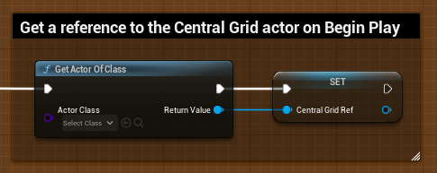
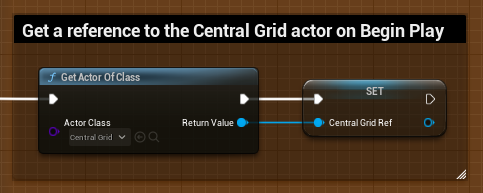

NOTE : Although documentation and examples are already available, the plugin is currently undergoing the Unreal review process.

---

[Full documentation](https://carboniq-dev.github.io/docs/)

# Snap Central - Example Integration

This tutorial illustrates the utilization of the Unreal Engine 5 Snap Central plugin in conjunction with the Third Person template. To follow this example, please acquire the plugin from the Epic Games Store. Upon completion of the purchase, install the plugin and implement the required modifications to ensure seamless operation and integration.

## Before

## After

[Video Demo](https://www.youtube.com/watch?v=WuYTlhWh9xs/)
